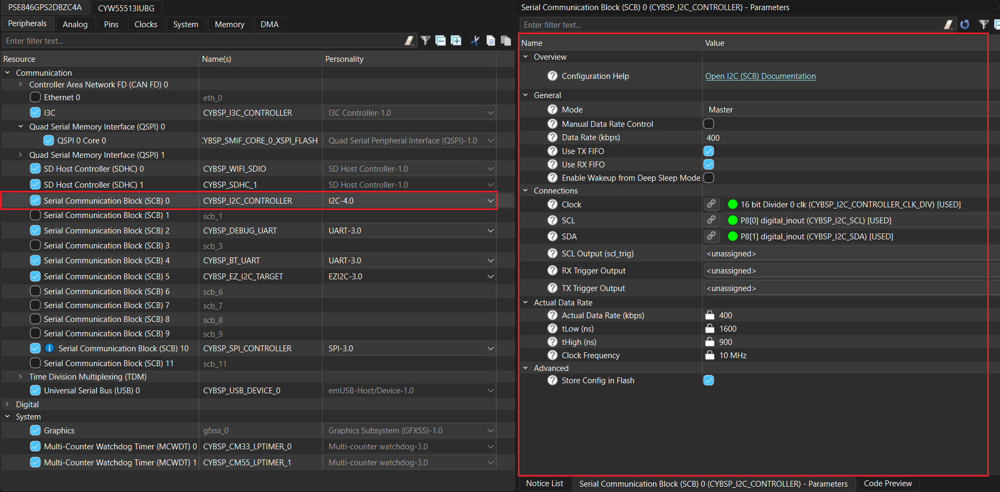

# FT3268 capacitive touch panel driver library for ModusToolbox&trade;

## Overview

This library provides functions to support Capacitive Touch Panel (CTP) on 1.43 inch AMOLED circular (CO5300) wearable display driven by FT3268 controller. This 1.43 inch MIPI DSI AMOLED display is used with PSOC&trade; EDGE E84 EVALUATION KIT.

## Features

* Ready-to-use driver
* Can be used with or without an RTOS
* All individual functions implemented: Init, Get Single touch, Touch interrupt handler

## Quick start

Follow the steps below to add the driver in a graphics application for PSOC&trade; Edge E84 Evaluation Kit.

1. Create a [PSOC&trade; Edge MCU: Empty application](https://github.com/Infineon/mtb-example-psoc-edge-empty-app) by following "Create a new application" section in [AN235935 – Getting started with PSOC&trade; Edge E8 on ModusToolbox&trade; software](https://www.infineon.com/AN235935) application note

2. Add the *touch-ctp-ft3268* library to this application using Library Manager

3. Use Device Configurator to configure Serial Communication Block (SCB) as an I2C interface for the touch driver in the application as follows:
  
   - Enable Serial Communication Block (SCB) resource and configure the same for FT3268 as shown in **Figure 1**

     **Figure 1. SCB I2C controller configuration in device-configurator**

     

4. Save the modified configuration(s) in Device Configurator

5. Use the driver APIs in the application as shown in the following code snippet:

    ```cpp
    #include "mtb_ctp_ft3268.h"
    #include "cybsp.h"

    /***************************************************************************
    * Macros
    ***************************************************************************/
    #define INT_PRIORITY (2UL)
    /* Following GPIO pins should be configured per board schematics in the
     * Device Configurator. 
     * The values provided here serve as an example from driver API usage
     * perspective.
     */
     #define INT_PIN_NUM (2U)
     #define RST_PIN_NUM (3U)


    /***************************************************************************
    * Global Variables
    ***************************************************************************/
    cy_stc_scb_i2c_context_t i2c_controller_context;

    cy_stc_sysint_t mI2C_SCB_IRQ_cfg =
    {
        .intrSrc      = CYBSP_I2C_CONTROLLER_IRQ,
        .intrPriority = INT_PRIORITY
    };


    /***************************************************************************
    * Function name: i2c_interrupt_callback
    ***************************************************************************/
    void i2c_interrupt_callback(void)
    {
        Cy_SCB_I2C_Interrupt(CYBSP_I2C_CONTROLLER_HW, &i2c_controller_context);
    }


    /***************************************************************************
    * Code
    ***************************************************************************/
    int main(void)
    {
        mtb_ctp_touch_event_t touch_event;

        cy_en_scb_i2c_status_t i2c_status;
        cy_rslt_t result;
        int x = 0;
        int y = 0;

        mtb_ctp_ft3268_config_t ft3268_params =
        {
            .scb_inst    = CYBSP_I2C_CONTROLLER_HW,
            .i2c_context = &i2c_controller_context,
            .rst_port    = GPIO_PRT17,
            .int_port    = GPIO_PRT17,
            .rst_pin     = RST_PIN_NUM,
            .int_pin     = INT_PIN_NUM,
            .int_num     = ioss_interrupts_gpio_17_IRQn,
        };

        /* Configures SCB0 as I2C controller. */
        i2c_status = Cy_SCB_I2C_Init(CYBSP_I2C_CONTROLLER_HW, &CYBSP_I2C_CONTROLLER_config, &i2c_controller_context);
        if (CY_SCB_I2C_SUCCESS != i2c_status )
        {
            /* Handles possible errors. */
            CY_ASSERT(0);
        }

        /* Interrupt initialization for SCB block */
        Cy_SysInt_Init(&mI2C_SCB_IRQ_cfg, &i2c_interrupt_callback);
        NVIC_EnableIRQ((IRQn_Type)mI2C_SCB_IRQ_cfg.intrSrc);

        /* Enable I2C */
        Cy_SCB_I2C_Enable(CYBSP_I2C_CONTROLLER_HW);

        /* Initialize FT3268 touch driver */
        result = mtb_ctp_ft3268_init(&ft3268_params);
        if (CY_RSLT_SUCCESS == result)
        {
            /* Check if touch event is detected */
            if(ft3268_params.touch_event)
            {
                /* Read touch coordinates */
                i2c_status = mtb_ctp_ft3268_get_single_touch(&touch_event, &x, &y);
                if (CY_SCB_I2C_SUCCESS != i2c_status)
                {
                    CY_ASSERT(0);
                }
                ft3268_params.touch_event = false;
            }
        }

        for (;;)
        {
        }
    }
    ```
## More information

For more information, see the following documents:

* [API reference guide](./API_reference.md)
* [ModusToolbox&trade; software environment, quick start guide, documentation, and videos](https://www.infineon.com/modustoolbox)
* [AN239191](https://www.infineon.com/AN239191) – Getting started with graphics on PSOC&trade; Edge MCU
* [Infineon Technologies AG](https://www.infineon.com)

---
© 2025, Cypress Semiconductor Corporation (an Infineon company)
